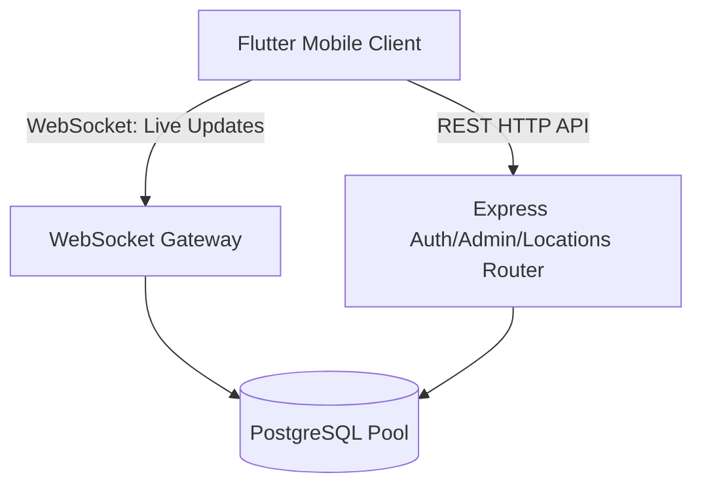

# Family Tracker — Technical Documentation

A secure, private family location tracking application built with a Node.js/TypeScript backend, PostgreSQL storage, and a Flutter mobile client.

---

## 1. System Architecture

The project features a decoupled, client-server architecture:



### A. Backend Architecture (Node.js & TypeScript)
- **Framework**: Express with modular routing.
- **WebSocket Protocol**: WS package with token-verified upgrades.
- **Database Access**: Node-postgres with optimized connection pool constraints.

### B. Frontend Architecture (Flutter)
- **Presentation Design**: Clean Architecture separated by modules (Auth, Members, Live Map, History, Tracking).
- **State Management**: Riverpod (StateNotifier, AsyncNotifier).
- **Maps Rendering**: OpenStreetMap tiles rendering with custom marker layers on `flutter_map`.

---

## 2. Folder Directories

### Backend
```
backend/
├── src/
│   ├── config/          # Configurations
│   ├── database/        # DB Pool setup
│   ├── middleware/      # Auth & Error middlewares
│   ├── modules/         # Auth, Members, Locations controllers
│   ├── shared/          # Log utilities
│   ├── websocket/       # WS Connection Manager
│   └── app.ts           # App Entrypoint
├── schema.sql           # Schema SQL definition
└── Dockerfile           # Docker build configuration
```

### Frontend
```
frontend/
├── lib/
│   ├── core/            # Networks, routers, themes, utils
│   ├── features/
│   │   ├── auth/        # Login and session logic
│   │   ├── members/     # Admin dashboard & User CRUD
│   │   ├── live_map/    # WebSocket handlers & OSM map
│   │   ├── history/     # Route replay, filters & stats
│   │   └── tracking/    # Background geolocator stream & SQLite cache
│   └── main.dart        # Flutter entrypoint
```

---

## 3. Database Schema

### PostgreSQL Schema
1. **users**:
   - `id`: UUID (Primary Key)
   - `email`: VARCHAR(255) (Unique)
   - `password_hash`: VARCHAR(255)
   - `role`: VARCHAR(20) ('admin', 'member')
   - `name`: VARCHAR(100)
   - `phone`: VARCHAR(20)
   - `device_name`: VARCHAR(100)
   - `photo_url`: TEXT
   - `current_session_id`: UUID (Session validation)
   - `online_status`: BOOLEAN
   - `last_seen`: TIMESTAMP
2. **locations**:
   - `id`: SERIAL (Primary Key)
   - `user_id`: UUID (Foreign Key -> users.id ON DELETE CASCADE)
   - `latitude`: DOUBLE PRECISION
   - `longitude`: DOUBLE PRECISION
   - `accuracy`: DOUBLE PRECISION
   - `speed`: DOUBLE PRECISION
   - `battery_percentage`: INTEGER
   - `charging_status`: BOOLEAN
   - `gps_enabled`: BOOLEAN
   - `internet_available`: BOOLEAN
   - `timestamp`: TIMESTAMP

---

## 4. API Documentation

### Authentication & Profiles
* `POST /api/login` — Parameters: `{ email, password }`. Returns: `{ token, user }`.
* `POST /api/logout` — Header: `Authorization: Bearer <token>`. Clears database active session.
* `GET /api/profile` — Returns active user profile.

### Member Management (Admin Guarded)
* `POST /api/members` — Creates a new family member.
* `GET /api/members` — Returns all registered family members.
* `PUT /api/members/:id` — Edits member profile.
* `DELETE /api/members/:id` — Deletes family member and cleans locations database.

### Locations & History
* `POST /api/locations/sync` — Processes batch coordinate uploads inside transactions.
* `GET /api/locations/history` (Admin Guarded) — Parameters: `userId`, `startDate`, `endDate`. Returns points lists and computed travel metrics.

---

## 5. Deployment Guide

### Running via Docker
1. Configure environment variables in `.env`.
2. Build and launch:
   ```bash
   docker build -t family-tracker-backend .
   docker run -p 3000:3000 --env-file .env family-tracker-backend
   ```
